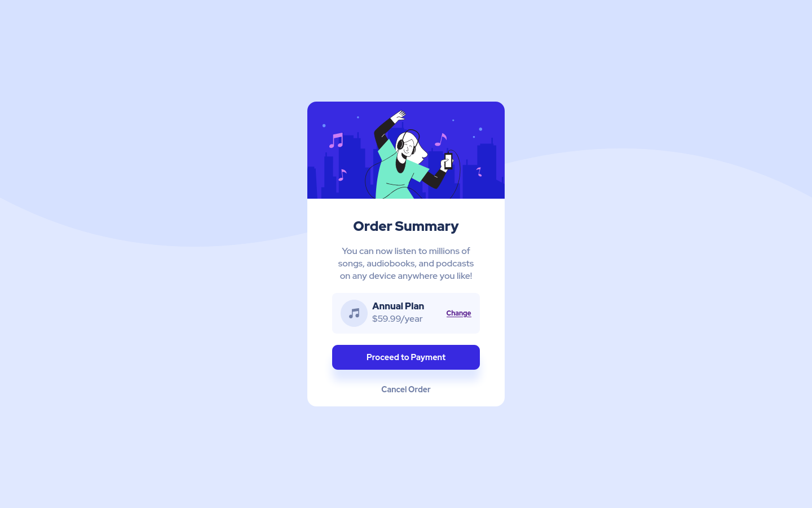

# Frontend Mentor - Cartão de resumo de pedido

Esta é uma solução para o [Desafio do cartão de resumo do pedido no Frontend Mentor](https://www.frontendmentor.io/challenges/order-summary-component-QlPmajDUj). Os Challenges  do Frontend Mentor ajudam melhorar as habilidades de codificação criando projetos realistas.

## Índice
  - [Índice](#índice)
  - [Visão geral](#visão-geral)
    - [Desafio](#desafio)
    - [Screenshot](#screenshot)
    - [Links](#links)
    - [Desenvolvimento contínuo](#desenvolvimeto-continuo)
- [Meu processo](#meu-processo)
  - [Construído com](#construído-com)
- [Autor](#autor)

## Visão geral

###  Desafio
Os usuários devem ser capazes de:

Ver os estados de foco para os elementos interativos

### Screenshot

### Links
- URL da solução: [github.com/eliseuSousa/card-resumo-pedido](https://github.com/eliseuSousa/card-resumo-pedido)
- URL do site: [Frontend Mentor | Order summary card](https://eliseusousa.github.io/card-resumo-pedido/)

## Meu processo

### Construído com:
- HTML5
- CSS3
- Flexbox
- Fluxo de trabalho mobile-first 

### Desenvolvimento contínuo
Pretendo aperfeiçoar aperfeiçoar a utilização da metodologia BEM para a escolha de nome de classes assim como o uso de mais amplo de variáveis CSS para os próximos projetos.

## Autor 
- Site - [Eliseu Sousa](https://eliseusousa.github.io/portfolio/)
- Mentor Frontend - [@eliseuSousa](https://www.frontendmentor.io/profile/eliseuSousa)
